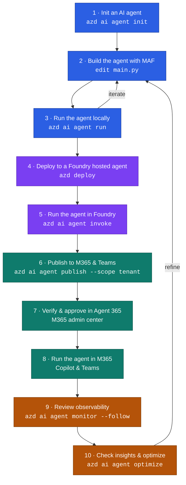

# 🔎 Researcher Agent

A [Microsoft Agent Framework](https://learn.microsoft.com/agent-framework/) (MAF) agent, hosted on
[Microsoft Foundry](https://learn.microsoft.com/azure/foundry/agents/concepts/hosted-agents) and
published to Microsoft 365 Copilot and Teams.

The agent answers questions with brief, cited responses, grounded through the Web IQ MCP server.

## 🔄 Lifecycle



## 📁 Key files

```
azure.yaml                      project manifest — services, env, endpoint config
appPackage/                     Teams app icons (optional, for custom branding)
src/researcher-agent/
    main.py                     agent implementation
    requirements.txt            Python dependencies
    .env                        local-only secrets (never deployed)
    .agentignore                what to exclude from the deploy package
```

| File | Purpose |
| --- | --- |
| `azure.yaml` | The single source of truth. Declares the Foundry project, the agent service, environment variables, `codeConfiguration`, and `agentEndpoint`. Everything `azd` provisions, deploys, and patches comes from here. |
| `src/researcher-agent/main.py` | Agent implementation — builds the `FoundryChatClient`, registers tools, and serves the agent with `ResponsesHostServer`. The `codeConfiguration.entryPoint`. |
| `src/researcher-agent/requirements.txt` | Python dependencies, installed remotely at deploy time (`dependencyResolution: remote_build`). |
| `src/researcher-agent/.agentignore` | Gitignore-style list of paths excluded from the deploy package. Excludes `.env`, `.azure/`, `.venv/`, and tooling files. Only the root file is read. |
| `src/researcher-agent/.env` | Local development values. Excluded by `.agentignore`, so deployed containers get configuration from the `env` map instead. |
| `src/researcher-agent/.env.example` | Template showing which variables are required, safe to commit. |
| `.azure/<env>/.env` | `azd` environment values written by `azd env set`. Gitignored — this is where `${VAR}` references resolve from. |
| `appPackage/color.png`, `outline.png` | Teams app icons, 192×192 and 32×32. Only used when building a package with `azd ai agent pack`; `azd ai agent publish` generates its own. |
| `appPackage/generate_icons.py` | Regenerates those icons. Requires Pillow. |

Generated by tooling — safe to delete and regenerate:

| File | Created by |
| --- | --- |
| `eval.yaml`, `evaluators/`, `.agent_configs/` | `azd ai agent eval` — eval definition, rubric, and the baseline model/instructions snapshot |
| `appPackage.zip`, `.appPackage.zip.azd-generated`, `TEAMS_APP_SETUP.md` | `azd ai agent pack` / `publish` |
| `devTools/` | Local run tooling logs |
| `.dockerignore` | Container builds only — unused in `code` deploy mode |

`agent.yaml` and `agent.manifest.yaml` are **deprecated** and not present here. All hosted agent
configuration lives in `azure.yaml`; `azd` only falls back to them when `azure.yaml` omits
`agentEndpoint`.

## 📋 Prerequisites

| Requirement | Notes |
| --- | --- |
| [Azure Developer CLI](https://learn.microsoft.com/azure/developer/azure-developer-cli/install-azd) | 1.27.1 or later |
| [azd Foundry extensions](https://learn.microsoft.com/azure/foundry/agents/how-to/install-cli-foundry-extensions) | `azure.ai.agents` ≥ 1.0.0-beta.8, `azure.ai.projects` ≥ 1.0.0-beta.4 |
| Python 3.13 | Matches `codeConfiguration.runtime` |
| Azure subscription | Permission to create Foundry and Azure Bot Service resources |

### 🧩 Install the azd Foundry extensions

The `azd ai agent …` commands ship as **azd extensions**, not with the base CLI. Install the
`microsoft.foundry` meta-package, which pulls in the provider extensions implementing the
`azure.ai.*` service hosts used by `azure.yaml`:

```bash
azd extension install microsoft.foundry
```

Extensions resolve from the registered `azd` source (`https://aka.ms/azd/extensions/registry`):

```bash
azd extension source list                        # registered sources
azd extension list                               # everything available
azd extension list --installed                   # what you have
azd extension show azure.ai.agents               # details for one extension
azd extension install azure.ai.agents -v 1.0.0-beta.16   # pin a version
azd extension update --all                       # update everything
azd extension uninstall azure.ai.agents          # remove one
```

| Extension | Provides |
| --- | --- |
| `azure.ai.agents` | The `azure.ai.agent` host and every `azd ai agent …` command |
| `azure.ai.projects` | The `azure.ai.project` host and the `microsoft.foundry` infra provider |
| `azure.ai.connections` | The `azure.ai.connection` host (used for the Web IQ secret) |
| `azure.ai.toolboxes` | The `azure.ai.toolbox` host |
| `azure.ai.skills` / `azure.ai.routines` | The `azure.ai.skill` and `azure.ai.routine` hosts |
| `azure.ai.inspector` | The local Agent Inspector UI used by `azd ai agent run` |
| `azure.ai.finetune` | Model fine-tuning (optional) |

Providers apply at different phases: `azure.ai.project` and `azure.ai.connection` during
`azd provision`; `azure.ai.agent`, `azure.ai.toolbox`, `azure.ai.skill`, and `azure.ai.routine`
during `azd deploy`. Run `azd up` to cover both.

Pin minimum versions in `azure.yaml` so collaborators fail fast on an outdated toolchain:

```yaml
requiredVersions:
    azd: ">=1.27.1"
    extensions:
        azure.ai.agents: ">=1.0.0-beta.8"
        azure.ai.projects: ">=1.0.0-beta.4"
```

Docs: [Install the azd Foundry extensions](https://learn.microsoft.com/azure/foundry/agents/how-to/install-cli-foundry-extensions) ·
[azd extensions](https://learn.microsoft.com/azure/developer/azure-developer-cli/extensions-overview)

## 🔐 1. Sign in

```bash
azd auth login
azd auth login --check-status
```

`azd` keeps its own credential store, separate from `az`. If the two are signed in as different
accounts, code using `DefaultAzureCredential` may pick the Azure CLI identity rather than the `azd`
one, because the CLI credential is tried first. Confirm both when they must agree:

```bash
azd auth login --check-status   # azd identity
az account show                 # az identity
```

Select or create an environment. Values live in `.azure/<env>/.env`, which is gitignored:

```bash
azd env list
azd env new my-env      # or: azd env select my-env
```

Docs: [Sign in with azd](https://learn.microsoft.com/azure/developer/azure-developer-cli/reference#azd-auth-login) ·
[Environments](https://learn.microsoft.com/azure/developer/azure-developer-cli/manage-environment-variables)

## 🚀 2. Initialize an agent

This project was scaffolded from the Agent Framework "basic responses" sample. To reproduce it,
point `-m` at that sample's agent manifest:

```bash
azd ai agent init -m https://github.com/microsoft/agent-framework/blob/main/python/samples/04-hosting/foundry-hosted-agents/responses/basic/agent.manifest.yaml
```

The manifest declares the agent name, the `responses` protocol, the model resource, and the
`AZURE_AI_MODEL_DEPLOYMENT_NAME` variable. When `-m` points at an **agent manifest**, `azd`
generates `azure.yaml` from it; when it points at a sample's unified `azure.yaml`, that file is
adopted as the project manifest instead.

Or start interactively, which prompts for the Foundry project, model deployment, and agent name:

```bash
azd ai agent init
```

Useful flags:

```bash
azd ai agent init --deploy-mode code   # upload source, build remotely (no Docker)
azd ai agent init -m <path-or-url>     # start from a sample manifest or template
azd ai agent sample                    # browse the sample catalog
```

`code` mode (used here) needs no Docker. `container` mode builds from a `Dockerfile` instead.

Docs: [Initialize a hosted agent project](https://learn.microsoft.com/azure/foundry/agents/how-to/init-agent-project) ·
[Author azure.yaml](https://learn.microsoft.com/azure/foundry/agents/how-to/author-azure-yaml) ·
[Agent Framework samples](https://github.com/microsoft/agent-framework/tree/main/python/samples)

## 🛠️ 3. Build the agent

Agent logic lives in [`src/researcher-agent/main.py`](src/researcher-agent/main.py): construct a
`FoundryChatClient`, attach tools, wrap both in an `Agent`, and serve it with `ResponsesHostServer`.

Dependencies are declared in `requirements.txt` and resolved remotely at deploy time
(`dependencyResolution: remote_build`).

Docs: [Agent Framework](https://learn.microsoft.com/agent-framework/) ·
[Tools overview](https://learn.microsoft.com/agent-framework/agents/tools/)

### ⚙️ Configuration

Environment variables are declared in the `env` map of `azure.yaml`, never baked into the image.
`.env` is excluded from deployment by `.agentignore`, so it applies to local runs only.

```yaml
env:
    AZURE_AI_MODEL_DEPLOYMENT_NAME: ${AZURE_AI_MODEL_DEPLOYMENT_NAME}
    WEB_IQ_API_KEY: $${{connections.web-iq-mcp.credentials.key}}
```

Two substitution syntaxes are in play:

- `${VAR}` — resolved by `azd` from the active environment (`azd env set VAR <value>`).
- `$${{connections.<name>.credentials.<field>}}` — resolved by **Foundry** at sandbox start from a
  project connection, so the secret never reaches `azure.yaml`, the azd environment, or the image.
  The leading `$$` is required: `azd` runs its own `envsubst` pass first and fails on a bare
  `${{...}}` with `unable to parse variable name`. `$$` escapes to a single `$`.

Don't declare `FOUNDRY_PROJECT_ENDPOINT` — the platform injects it, and declaring it shadows the
managed value.

Docs: [Configure environment variables](https://learn.microsoft.com/azure/foundry/agents/how-to/configure-hosted-agent-env-variables) ·
[Add a connection](https://learn.microsoft.com/azure/foundry/how-to/connections-add)

## 💻 4. Run locally

```bash
azd ai agent run
```

Starts the agent on `http://localhost:8088` and the Agent Inspector UI on `http://localhost:8087`.
`azd` injects the resolved `env` map and sets `FOUNDRY_PROJECT_ENDPOINT` automatically, so local
behaviour matches the deployed container. Model calls still go to the real Foundry project.

```bash
azd ai agent run --port 9090 --inspector-port 9002
azd ai agent run --no-client                  # skip the Inspector
azd ai agent run -c "python main.py"          # override the start command
azd ai agent invoke --local "Hello!"          # send a prompt from another shell
```

Docs: [Run a hosted agent locally](https://learn.microsoft.com/azure/foundry/agents/how-to/run-hosted-agent-locally)

## ☁️ 5. Deploy

```bash
azd provision   # first time only — creates the Foundry project and model deployment
azd deploy      # package source, build remotely, create a new agent version
azd up          # provision + deploy
```

Each deploy creates an immutable **agent version**. With the default version selector
(`@latest`, 100%), new versions serve immediately and no republish is needed.

```bash
azd ai agent show                       # active version, endpoints, identity, playground URL
azd ai agent invoke "Hello!"            # call the deployed agent
azd ai agent endpoint show              # protocols, auth schemes, version selector
```

Docs: [Deploy a hosted agent](https://learn.microsoft.com/azure/foundry/agents/how-to/deploy-hosted-agent) ·
[Configure your agent endpoint](https://learn.microsoft.com/azure/foundry/agents/how-to/configure-agent)

### 🔌 Endpoint configuration

Protocols and authorization schemes live on the agent's **stable endpoint**, not on a version, and
are declared under `agentEndpoint` in `azure.yaml`:

```yaml
agentEndpoint:
    authorizationSchemes:
        - type: BotServiceTenant
```

Fields omitted from this block are preserved by `endpoint update`, so the live endpoint keeps the
`activity` protocol and version selector even though neither is declared.

Don't declare `protocols` here. The live endpoint needs `activity` for Microsoft 365, but listing
it locally makes `azd ai agent run` classify the project as an activity agent and launch the
Microsoft 365 Agents Playground instead of the Agent Inspector UI — leaving nothing on port 8087.

Apply without creating a new version:

```bash
azd ai agent endpoint update
azd ai agent endpoint show
```

Authorization schemes control who may call the agent:

| Scheme | Who can call |
| --- | --- |
| `Entra` | Callers holding **Foundry Agent Consumer** (or higher) on the project |
| `BotServiceRbac` | Bot Service channel + the caller's Azure RBAC on the project |
| `BotServiceTenant` | Bot Service channel, scoped to your tenant — any tenant user |

`activity` is the protocol Microsoft 365 Copilot and Teams speak; publishing enables it
automatically. Publishing from the **portal** may reset the schemes to `BotServiceRbac` — re-run
`azd ai agent endpoint update` afterwards to restore the declared configuration.

## 📦 6. Publish to Microsoft 365 and Teams

```bash
azd ai agent publish --scope tenant --app-version 1.0.1
```

Foundry builds the Teams app package server-side and submits it to the Microsoft 365 catalog.

| Scope | Visibility | Admin approval |
| --- | --- | --- |
| `shared` | Only you; shareable by link | Not required |
| `tenant` | Everyone, under **Built by your org** | Required |

`--app-version` is the **M365 catalog** version, independent of the agent version. It must contain
only digits and periods, can't start with `0`, and must increase on every republish — otherwise the
API returns `Microsoft 365 app with <version> version already exists`.

Requires `Microsoft.BotService` registered and the **Azure Bot Service Contributor** role:

```bash
az provider register --namespace Microsoft.BotService
```

To customize the icons, build the package locally and sideload it instead — `publish` generates
default icons:

```bash
azd ai agent pack --output-dir ./dist
# replace color.png (192x192) and outline.png (32x32, transparent), rezip at the root
atk install --file-path ./dist/appPackage.zip --scope Personal
```

Docs: [Publish from the Foundry portal](https://learn.microsoft.com/azure/foundry/agents/how-to/publish-copilot) ·
[Publish with the REST API](https://learn.microsoft.com/azure/foundry/agents/how-to/publish-copilot-virtual-network)

## ✅ 7. Approve in Agent 365

For `tenant` scope, an administrator approves the agent in the
[Microsoft 365 admin center](https://admin.cloud.microsoft/#/agents/all/requested) under
**Requests**, optionally applying an Agent 365 policy template (Conditional Access, access
packages, custom security attributes). The default template requires no extra selections.

After approval the agent appears under **Built by your org** in the agent store. The store cache
refreshes roughly hourly, so allow time before it becomes visible.

Docs: [Agent 365](https://learn.microsoft.com/azure/foundry/agents/how-to/agent-365)

## 💬 8. Run in Microsoft 365

Open the agent from the Microsoft 365 Copilot or Teams agent store and send it a prompt. End users
don't need a Copilot license to use a published agent in Copilot Chat.

If a conversation stops responding, start a **new chat** — a conversation can enter a locked state
after a tool error and won't recover. In Teams, send `/foundry_new_preview` to reset.

Docs: [Runtime troubleshooting](https://learn.microsoft.com/azure/foundry/agents/how-to/publish-copilot-virtual-network#troubleshooting)

## 📊 9. Monitor

```bash
azd ai agent monitor                      # recent logs
azd ai agent monitor --follow             # stream in real time
azd ai agent monitor --type system        # platform logs
azd ai agent monitor --session-id <id>    # a specific session
azd ai agent sessions list                # list sessions
```

Foundry injects `APPLICATIONINSIGHTS_CONNECTION_STRING` and enables OpenTelemetry tracing by
default; traces, requests, and dependencies appear in the Application Insights resource created
during provisioning. Set `AZURE_EXPERIMENTAL_ENABLE_GENAI_TRACING=true` to capture GenAI spans.

```bash
azd ai agent doctor                       # diagnose project problems
```

Docs: [Monitor a hosted agent](https://learn.microsoft.com/azure/foundry/agents/how-to/monitor-hosted-agent) ·
[Tracing and observability](https://learn.microsoft.com/azure/foundry/observability/concepts/trace-data)

## 🔍 10. Evaluate and optimize

```bash
azd ai agent eval generate              # scaffold eval.yaml, dataset, and rubric
azd ai agent eval run                   # execute the run defined in eval.yaml
azd ai agent eval list                  # evaluations in this project
azd ai agent eval show <id>             # details of one run

azd ai agent optimize                   # evaluate and optimize the agent
azd ai agent optimize status <id> --watch
azd ai agent optimize list
```

`eval generate` writes `eval.yaml`, `evaluators/`, and `.agent_configs/baseline/` — the latter
snapshots the model and instructions the run is scored against.

Use the results to refine instructions, tools, and model choice, then redeploy. Because the
version selector tracks `@latest`, a redeploy reaches published surfaces without republishing.

Docs: [Agent optimizer](https://learn.microsoft.com/azure/foundry/agents/concepts/agent-optimizer-overview) ·
[Evaluate agents](https://learn.microsoft.com/azure/foundry/concepts/evaluation-approach-gen-ai)

## 🧹 11. Clean up

```bash
azd ai agent delete                       # delete the agent
azd ai agent delete my-agent --version 2  # delete one version only
azd ai agent delete my-agent --force      # terminate active sessions first
azd down                                  # delete all provisioned resources
```

Deleting the agent doesn't remove the published Microsoft 365 app — remove that from the Microsoft
365 admin center. `azd down` deletes the resource group when the environment created the Foundry
project; an existing project is left in place.

Docs: [azd down](https://learn.microsoft.com/azure/developer/azure-developer-cli/reference#azd-down)

## 📖 Command reference

| Task | Command |
| --- | --- |
| Sign in | `azd auth login` |
| Initialize | `azd ai agent init` |
| Run locally | `azd ai agent run` |
| Invoke | `azd ai agent invoke "…"` (`--local` for local) |
| Provision | `azd provision` |
| Deploy | `azd deploy` |
| Show agent | `azd ai agent show` |
| Show endpoint | `azd ai agent endpoint show` |
| Update endpoint | `azd ai agent endpoint update` |
| Package for Teams | `azd ai agent pack` |
| Publish | `azd ai agent publish --scope tenant` |
| Monitor | `azd ai agent monitor --follow` |
| Diagnose | `azd ai agent doctor` |
| Evaluate | `azd ai agent eval run` |
| Delete | `azd ai agent delete` / `azd down` |

## 🩺 Troubleshooting

| Symptom | Cause | Fix |
| --- | --- | --- |
| `unable to parse variable name` on deploy | `azd` ran `envsubst` over a bare `${{…}}` | Escape as `$${{…}}` |
| MCP tool returns `401` | `MCPStreamableHTTPTool` has no `headers` parameter, so auth headers are silently dropped | Pass an `httpx.AsyncClient(headers=…)` via `http_client` |
| Published agent asks users to sign in to Foundry | Endpoint uses `Entra` or `BotServiceRbac`, and callers lack a Foundry role | Use `BotServiceTenant`, or grant **Foundry Agent Consumer** at project scope |
| `Microsoft 365 app with <version> version already exists` | `--app-version` was reused | Increment it |
| Conversation stops responding | Conversation locked after a tool error | Start a new chat |
| Endpoint config reverts after publishing | Portal publish rewrote the auth schemes | Re-run `azd ai agent endpoint update` |
